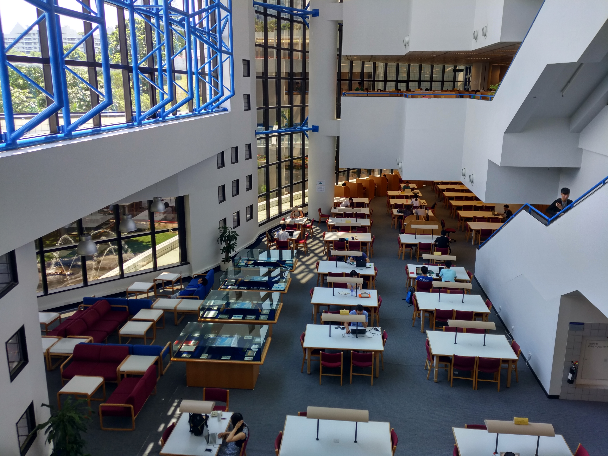
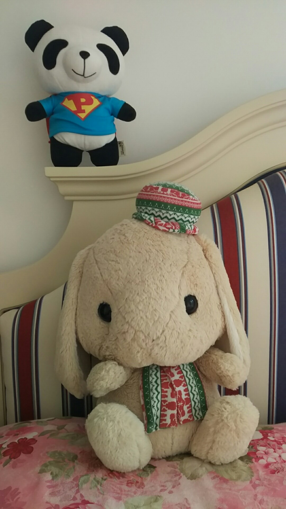

I graduated from the [Hong Kong University of Science and Technology (HKUST)](https://www.ust.hk) in Dec 2017, with a master's degree in financial mathematics.

I spent a memorable 1.5 years in the charming campus by the sea, where half of my time was devoted to financial mathematics, and the rest half to computer science.

Library that I used to frequent is my favorite. There are two seats on the LG3 floor which I almost deem as my private property.

Before that I studied finance in Renmin University of China (a second bachelor's degree in finance, 2013-2015).

Even before that, I was a journalist.

- China Daily, Hong Kong, 2010-2012
- master's degree in journalism, HKU, 2008-2009
- bachelor's degree in journalism, RUC, 2004-2008

I live with my wife, my daughter, and two stuffed animals -- a lopped-eared rabbit and a little giant panda.

That rabbit came to my home as she applied the job as a housemaid, but never did one day's work after she came (and settled).

She expresses enthusiasm by kicking anyone she likes (or hates).

*The rabbit is pointing to the camera saying look at this fool.*
