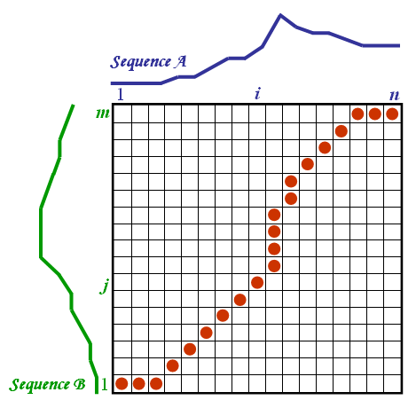

*A demo of code. Note how fast the optimized algorithms are, compared with brutal force. Over 95% of the entries are skipped.*

- For the C++ code for this project, click [here](https://github.com/imfl/data-mining) (GitHub).

## Introducing Dynamic Time Warping Distance into Matrix Profile

Matrix Profile (MP) has emerged as a new concept in the data mining community since 2016. It is a framework to extract information from time series, which later can be applied in similarity research. Two steps are involved:

1. construct a matrix profile
2. use the matrix profile

In Step 1, the current setting uses the traditional Euclidean distance to measure how similar two subsequences are. However, a better approach would be using the Dynamic Time Warping (DTW) distance. See the graph below for intuition.

*DTW is sharp in detecting similarity even if a curve has been stretched or squeezed.*

As an initial attempt in the academic community, I introduced DTW into MP.

The main challenge is --- the time complexity for computing both MP and DTW are heavy themselves, making the combination of the two intimidatingly expensive.

*Calculating DTW involves dynamic programming.*

My originalities are

1. adapting lower bound functions and using them to skip many unnecessary computations
2. applying randomized local search within each column of the matrix

### Summary

An abstract of this project is [here](https://github.com/imfl/data-mining/tree/master/summary/abstract.pdf) (PDF).

The empirical results are [here](https://github.com/imfl/data-mining/tree/master/summary/results.pdf) (PDF).

### More Information 

This project is an academic project that I did together with Lee Yik-Yeung, for [*COMP5331: Knowledge Discovery in Databases*](https://www.cse.ust.hk/~raywong/comp5331/), a postgraudate-level course that I took at the CS Dept. at HKUST in Fall 2017.

This project was supervised by [Prof. Raymond Wong](https://www.cse.ust.hk/~raywong/), one of the best teachers that I has ever met in my life. I would like to take this opportunity to again express my gratitude.

I am responsible for the algorithms and the code.

- For the C++ code for this project, click [here](https://github.com/imfl/data-mining) (GitHub).
