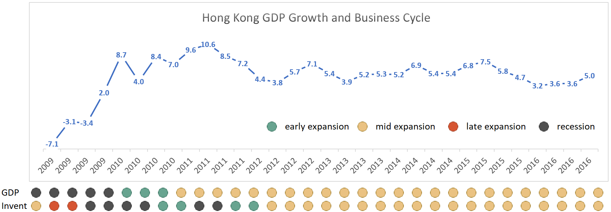
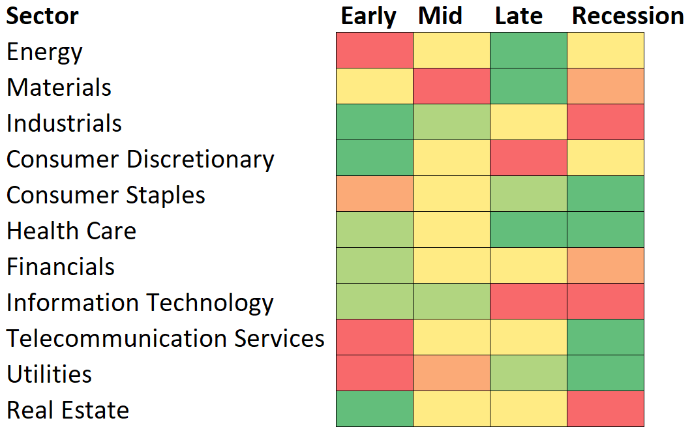
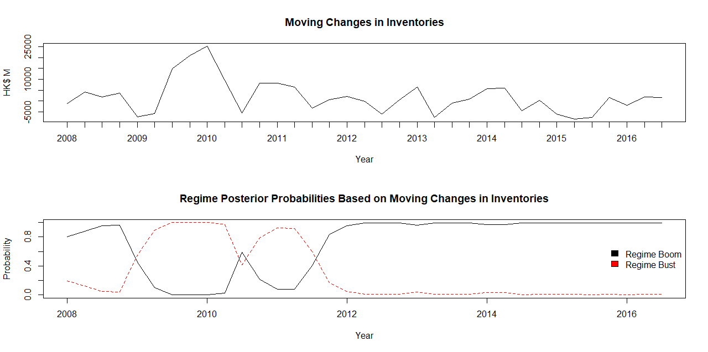

*Detecting which stage Hong Kong economy is in using Hidden Markov Model (HMM).*

- For the R code and related data for HMM, click [here](https://github.com/imfl/investment-strategies) (GitHub).

## A Sector Rotation Trading Strategy

We design and implement a sector rotation trading strategy in Hong Kong Stock Market.

We rotate the focus of our investment from one industry sector to another, according to the fluctuations of the business cycle.

Our strategy, which trades quarterly, yields a total return of 297.0% in the investment horizon, which spans from Q1 2009 to Q4 2016, compared to 113.0% for Hang Seng Index for the same period.

Two steps are involved:

1. detect the stage of the cycle
2. quantify the descriptive recommendations such as strong buy, neutral and sell

*A summary of buy-or-sell recommendations that investment theory gives for a sector given the stage it is in a business cycle.*

Techniques we have applied include:

- Principal Component Analysis (PCA) in stock selection
- Hidden Markov Model (HMM) in business cycle detection
- Monte Carlo methods, with Gibbs sampling ideas, for optimization

*A series of moving-window guesses using HMM: What is the probability that we are now in regime boom / regime bust?*

We also discuss using statistical techniques, such as skewness, kurtosis, and variance ratio tests, for fine-tuning our strategy.

### Summary

The presentation slides for this project are [here](https://github.com/imfl/investment-strategies/blob/master/summary/slides.pdf) (PDF).

The report of this project is [here](https://github.com/imfl/investment-strategies/blob/master/summary/report.pdf) (PDF) 1.

1 Figures in the presentation and the report are slightly different since we've made some improvements in between.

### More Information 

This project is an academic project that I did together with Wei Jian and Xing Siyu, for [*MAFS 6010K Algorithmic Quantitative Finance*](http://cting.x10host.com/AQF/AQF.html), a postgraduate-level course that I took at the Math Dept. at HKUST in Summer 2017.

This project was supervised by Prof. Christopher Ting from the Singapore Management University.

I am responsible for designing most of the algorithms, and for implmenting the HMM part using R (with `depmixS4` pacakge).

- For the R code and related data for HMM, click [here](https://github.com/imfl/investment-strategies) (GitHub).
